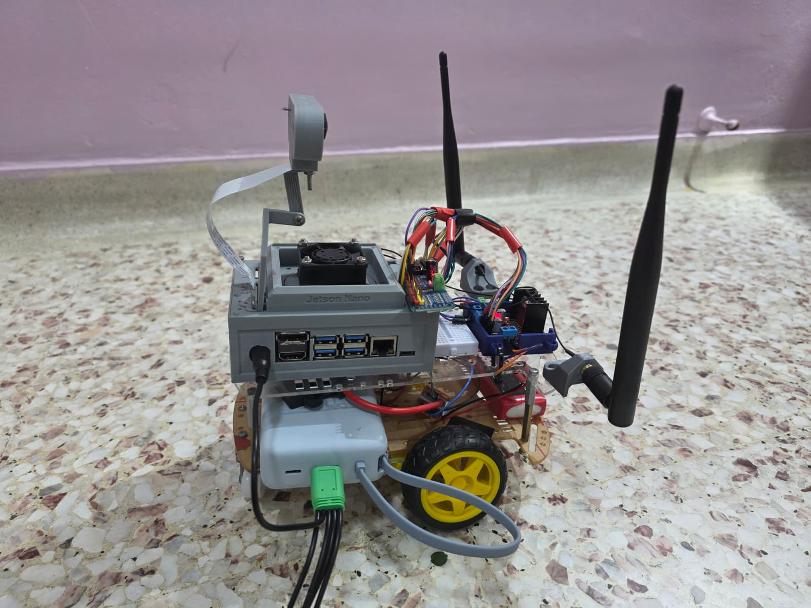
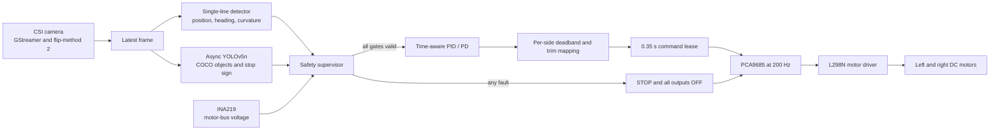
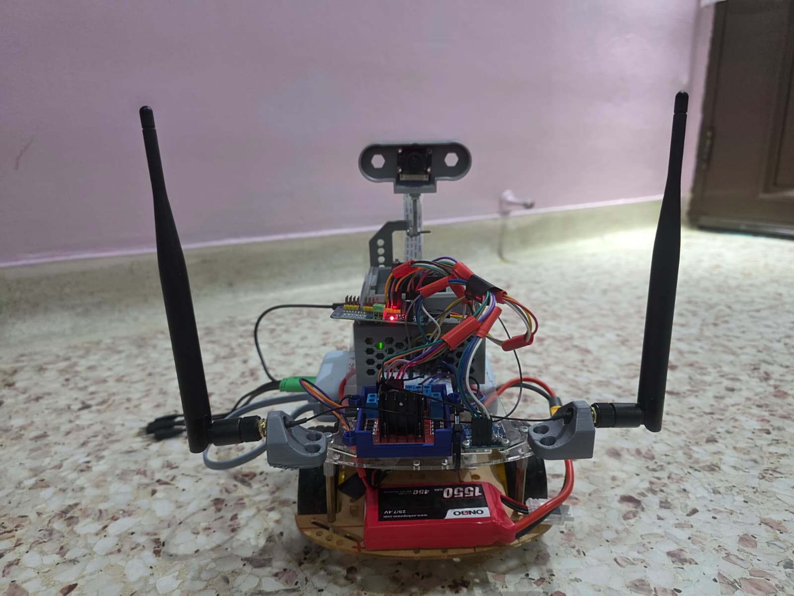
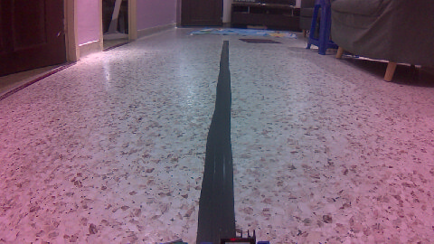
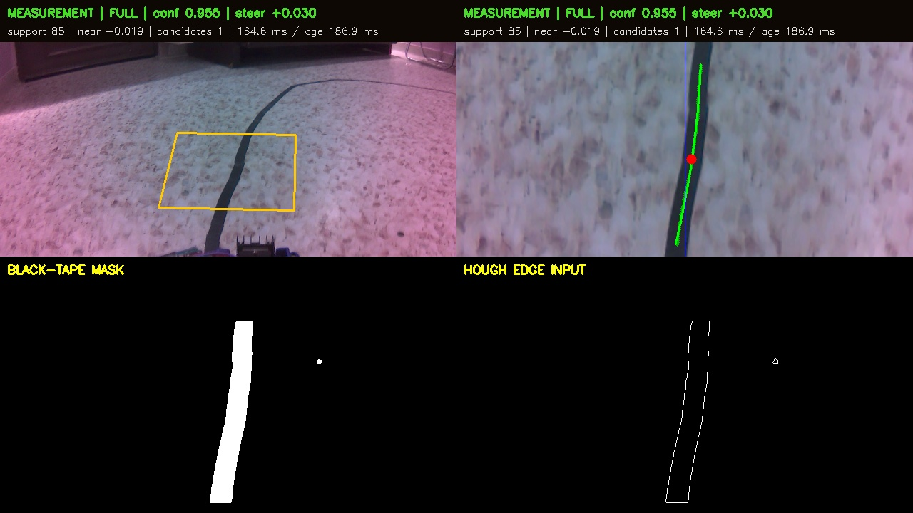
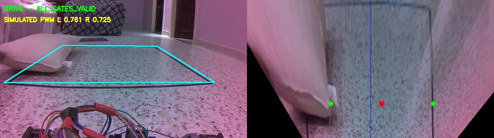
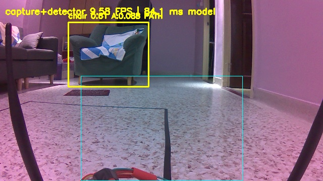
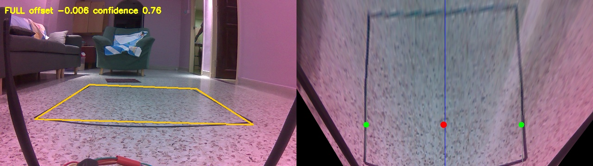

# Sentinel Drive

**Safety-gated lane following and object-aware stopping on an NVIDIA Jetson Nano robot car.**

[](https://developer.nvidia.com/embedded/jetson-nano-developer-kit)
[](requirements-jetson.txt)
[](docs/system_architecture.md)
[](SAFETY.md)

Sentinel Drive is a final-year engineering prototype that combines a CSI
camera, black-tape line perception, asynchronous YOLOv5 object detection,
differential-drive control, battery monitoring and hash-bound validation
gates. The dashboard is read-only; every physical runner is designed to stop
when perception, timing, voltage or command freshness becomes unsafe.



## What the project implements

| Capability | Implementation | Evidence status |
|---|---|---|
| Single black-line following | Connected-component selection, polynomial fitting, lookahead error and differential steering | Implemented; synthetic regression passed; continuous lap not verified |
| Object detection | Pinned YOLOv5 v6.0, CUDA FP16, COCO classes of interest | Physically benchmarked on CSI camera |
| Obstacle response | Relevant object classes like stop sign map to an immediate fail-safe STOP | Integrated motor-disabled person-stop test passed |
| Obstacle avoidance | Steering around an object | Obstacle avoidance after detecting the object at 1m radius |
| Motor control | PCA9685 PWM through an L298N, with calibrated per-side mapping | Raised-wheel and short floor calibration evidence exists from the physical prototype |
| Safety supervision | Camera, line, YOLO, voltage, lease and validation-gate checks | Implemented fail-closed |
| Monitoring | Read-only web dashboard with CSI and INA219 telemetry | Implemented; no motor command routes |

## System architecture



The camera has one owner. Lane perception runs in the control path while YOLO
runs as a latest-result worker. `control_core.py` only returns DRIVE when the
line, camera timestamp, YOLO result, obstacle state and voltage are all valid.
`safe_motor_output.py` then enforces the command lease and best-effort OFF
writes.

## Line, object and stop-sign logic

### Single-line following

`single_line_lane.py` extracts plausible black connected components inside the
calibrated ground-plane region. It rejects fragmented, oversized, noisy or
ambiguous candidates, fits the accepted line with a polynomial, and reports:

- lateral offset at a forward lookahead point;
- near-field offset;
- line heading and curvature;
- support, fit residual and confidence; and
- `FULL`, `LOST` or `AMBIGUOUS` status.

The controller consumes the normalized steering error only when status is
`FULL` and confidence is above the configured minimum. Missing or stale line
data commands STOP.

### Object-aware Avoidance

`yolov5_runtime.py` filters pretrained COCO detections to the configured road
users and scene hazards. The current conservative policy is:

| Detection | Supervisor result |
|---|---|
| `stop sign` | `STOP_SIGN_DETECTED` |
| `traffic light` | `TRAFFIC_LIGHT_UNCLASSIFIED` and STOP |
| person, bicycle, car, motorcycle, bus, truck or chair | `OBJECT_DETECTED_<CLASS>` and AVOID |
| no relevant fresh detection | `PATH_CLEAR` |
| stale, failed or frame-lagged YOLO result | STOP |

This is **object detection with obstacle avoidance path planning**.

## Measured results

All values below come from retained machine-generated artifacts. Rounded
display values are used here; exact values and SHA-256 identifiers are in the
[engineering evidence register](docs/project_evidence_register.md).

| Test | Physical condition | Result |
|---|---|---:|
| YOLOv5s real CSI baseline | CUDA FP16, 30 s | 7.08 complete FPS; 8.81 inference-only FPS |
| YOLOv5n real CSI benchmark | CUDA FP16, 30 s | 8.28 complete FPS; 10.65 inference-only FPS |
| YOLOv5n mean inference latency | CUDA FP16 | 93.89 ms |
| IPM lane dry run | Physical CSI, centred reference, 30 s | 11.80 FPS; 99.13% full-lane rate |
| Integrated control dry run | Physical CSI, motors disabled, 60 s | 8.74 control FPS; 95.57% fresh YOLO |
| Integrated object response | Same dry run | 45 object-stop frames; reason `OBJECT_DETECTED_PERSON` |
| Integrated lane fail-safe | Same dry run | 23 lane-stop frames; 404 DRIVE frames |
| Motor calibration | 7.688 V calibration point | 0.60 deadband; 0.75 cruise; right trim 0.98 |
| Straight-line calibration | Short guarded floor test | less than 5 cm lateral error over 0.5 m |

## Repository map

### Perception and control

| Path | Purpose |
|---|---|
| [`single_line_lane.py`](single_line_lane.py) | Outer black-line component selection, polynomial fit and steering observation. |
| [`ipm_lane.py`](ipm_lane.py) | Ground-plane transform and detector-mode dispatch. |
| [`yolov5_runtime.py`](yolov5_runtime.py) | Pinned YOLOv5 inference, path annotation, asynchronous latest-result worker and object-avoidance policy. |
| [`control_core.py`](control_core.py) | Time-aware PID, line/YOLO freshness checks and fail-safe supervisor. |
| [`motor_mapping.py`](motor_mapping.py) | Maps logical controller output onto measured left/right deadband, cruise and maximum PWM points. |
| [`safe_motor_output.py`](safe_motor_output.py) | Voltage guard, command lease, serialized I2C access and OFF enforcement. |
| [`manual_motor_control.py`](manual_motor_control.py) | PCA9685 and INA219 hardware adapter used by the guarded output layer. |

### Runners and validation

| Path | Purpose |
|---|---|
| [`integrated_control_dry_run.py`](integrated_control_dry_run.py) | Exercises lane, YOLO, safety and mapped-duty logic without motor commands. |
| [`track_run.py`](track_run.py) | Evidence-gated physical track runner used by the main integration workflow. |
| [`guarded_live_circle_run.py`](guarded_live_circle_run.py) | Validation-gated single-line circle commissioning runner; continuous-lap verification remains open. |
| [`guarded_straight_line_run.py`](guarded_straight_line_run.py) | Validation-gated, empty-lane straight-line commissioning runner without YOLO; physically unverified in this snapshot. |
| [`validation_manager.py`](validation_manager.py) | Records and verifies evidence plus test-time source hashes. |
| [`test_single_line_synthetic.py`](test_single_line_synthetic.py) | Hardware-free valid-line and rejection regression suite. |
| [`test_ipm_lane_synthetic.py`](test_ipm_lane_synthetic.py) | Dual-rail/IPM regression retained for the earlier detector path. |
| [`robot_dashboard.py`](robot_dashboard.py) | Read-only system and camera dashboard. |

The audited 5 August export also contributed tested runtime improvements to
`gst_camera_bridge.py`, `ipm_lane.py`, `safe_motor_output.py`,
`yolov5_runtime.py`, and `integration_self_test.py`. Local calibration files,
ungated commissioning runners, raw logs, model weights and failed-run archives
were deliberately not imported into the public repository.

## Photographic record

| Physical prototype | Raw straight-line camera input |
|---|---|
|  |  |

| Stationary single-line diagnostic | Integrated motor-disabled control dry run |
|---|---|
|  |  |

| YOLOv5n physical CSI benchmark | Physical IPM dry run |
|---|---|
|  |  |

The repository documents the generic COCO stop-sign recognition policy in code.

## Safe software-only verification

The synthetic tests do not open the camera, INA219, PCA9685 or motor driver:

```bash
python3 -m py_compile *.py
python3 test_single_line_synthetic.py
python3 test_ipm_lane_synthetic.py
python3 integration_self_test.py
python3 validation_manager.py show
```

The final command should show motion locked in a fresh checkout. Software-only
tests must never be promoted into physical evidence.

## Jetson deployment notes

The target is JetPack 4.x and Python 3.6. Keep NVIDIA's compatible CUDA PyTorch
build and system OpenCV/GStreamer packages. Do not blindly install a current
desktop YOLO requirements set on the Nano.

Third-party YOLO source and weights are deliberately not vendored. Provision
the pinned upstream revision and verify its identity with:

```bash
python3 prepare_yolov5_v6.py
```

Before any physical run, follow the ordered gate sequence in
[`docs/INTEGRATION_RUNBOOK.md`](docs/INTEGRATION_RUNBOOK.md) and the physical
controls in [`SAFETY.md`](SAFETY.md). Do not bypass a gate, widen a stale-data
limit or remove a voltage check merely to obtain motion.

## Viva walkthrough

Use [`docs/VIVA_WALKTHROUGH.md`](docs/VIVA_WALKTHROUGH.md) for a short,
evidence-led demonstration of the repository. The recommended route is:

1. state the verified/unverified boundary;
2. show the architecture and camera fan-out;
3. explain line observation and YOLO stop-sign/object detection policy;
4. show the safety supervisor and motor command lease;
5. open the retained physical evidence images and metrics; and
6. finish with limitations and the next validation step.

## Documentation

- [Safety contract](SAFETY.md)
- [Integration runbook](docs/INTEGRATION_RUNBOOK.md)
- [Engineering evidence register](docs/project_evidence_register.md)
- [Perception capability and evidence map](docs/perception_capabilities.md)
- [Viva walkthrough](docs/VIVA_WALKTHROUGH.md)
- [System architecture](docs/system_architecture.md)
- [Technical handover](docs/TECHNICAL_HANDOVER.md)
- [Drivetrain calibration record](docs/drivetrain_calibration_record.md)
- [Third-party notices](THIRD_PARTY_NOTICES.md)

## Known limitations

- A continuous autonomous circle/oval lap is not verified in this snapshot.
- Current controller gains are provisional until final physical tuning is
  recorded against the exact camera pose, track and power configuration.
- The pretrained model recognizes generic COCO objects and a generic stop-sign
  class; it is not a custom traffic-sign dataset or classifier.
- Camera pose, lighting, floor texture and power-mode changes require renewed
  physical validation.
- The software lease is defence in depth, not a safety-rated hardware E-stop.

## License status

No open-source license has been selected for the project-authored files. In the
absence of a license, normal copyright restrictions apply. YOLOv5 v6.0 is an
upstream GPL-3.0 project and remains under its own terms; see
[`THIRD_PARTY_NOTICES.md`](THIRD_PARTY_NOTICES.md).
