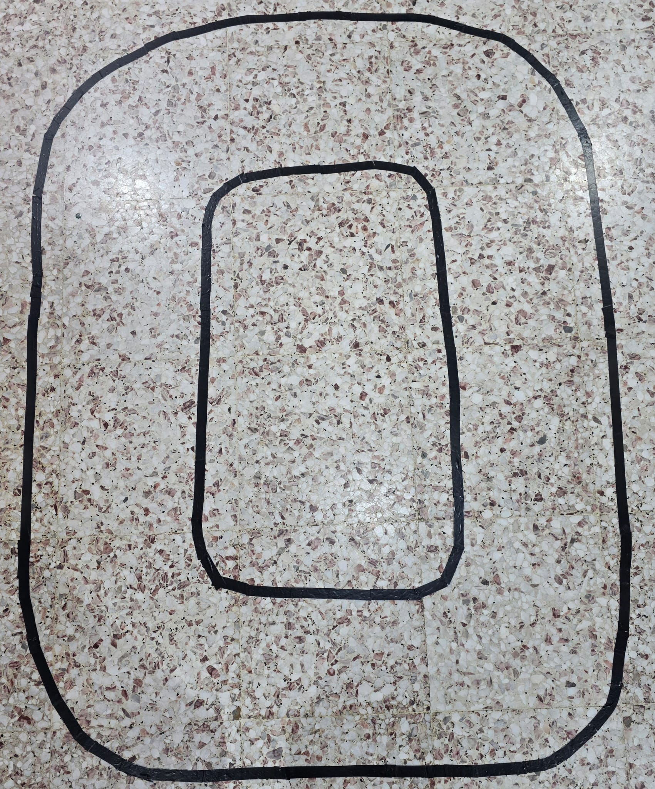
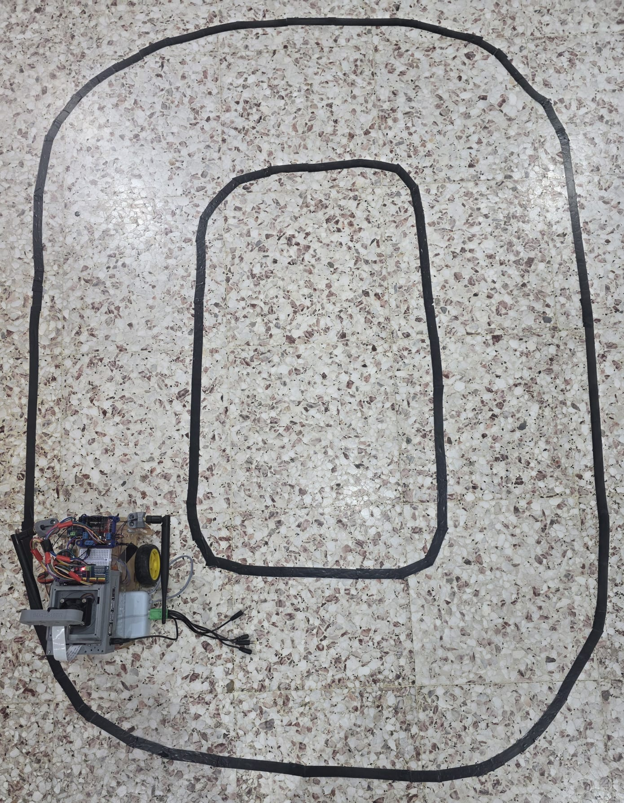
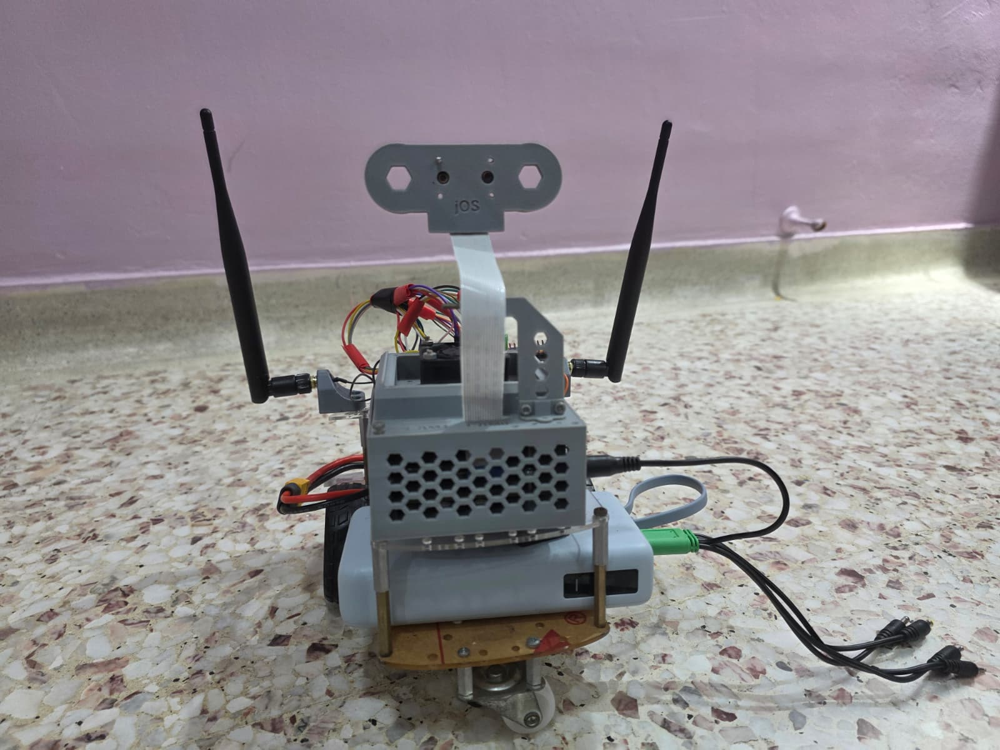
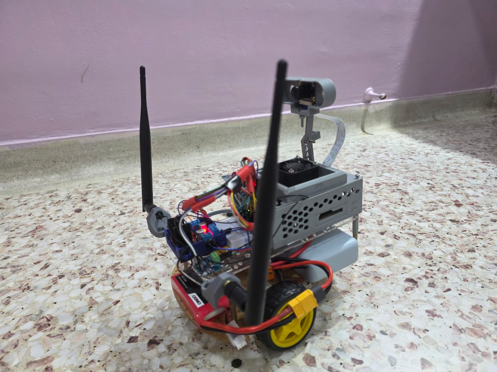

# Sentinel Drive — Jetson Nano Robot Car

Sentinel Drive is a safety-gated university prototype for lane perception,
obstacle-state monitoring and differential-drive control on an NVIDIA Jetson
Nano. The repository contains the project-authored Python control stack,
calibration tools, read-only monitoring dashboard, validation gates and
operator documentation.

> [!IMPORTANT]
> This is a **source snapshot, not a motion-authorized deployment bundle**.
> The local snapshot contains no physical evidence/results directory, does not
> contain the deployment-local `manual_motor_control.py` hardware adapter, and
> deliberately excludes YOLO source and model weights. A complete rounded-oval
> lap is **PROVISIONAL / NOT VERIFIED** by the files published here.

## Release status

| Item | Snapshot status |
|---|---|
| Build identifier | `SENTINEL-INTEGRATION-2026.07.27-OVAL1` |
| Physical motion authorization | `false` / `LOCKED` in `integration_gates.json` |
| Controller | `SOFTWARE_INITIAL_VALUES_NOT_PHYSICALLY_TUNED` |
| IPM configuration | `SITL_SEED_NOT_PHYSICALLY_CALIBRATED` |
| Drivetrain configuration | Persisted calibration values are present in `motor_config.json`; physical revalidation evidence is absent |
| Physical gate evidence | Not included in this source snapshot |
| Autonomous rounded-oval lap | **PROVISIONAL / NOT VERIFIED** |

Photographs in `docs/images/` document the prototype and final track asset;
they are not evidence that an autonomous lap completed.

## System structure

```text
CSI camera ──> GStreamer bridge ──> IPM lane detector ──> PID/safety supervisor
                                  └──────────────> asynchronous YOLOv5 worker

PID/safety supervisor ──> motor mapping ──> guarded motor-output adapter
INA219 telemetry ────────> safety guards ──> read-only dashboard / evidence logs
```

The safety architecture is fail-closed: current, hash-bound validation gates
and an explicit run-time confirmation are required before a physical runner can
energize the drivetrain. See [SAFETY.md](SAFETY.md) before operating any
hardware.

## Repository layout

| Path | Purpose |
|---|---|
| `track_run.py` | Guarded short physical lane-following runner; refuses operation until all required conditions pass. |
| `control_core.py` | PID, lane-state and safety-supervisor logic. |
| `ipm_lane.py` | IPM transform and black-tape paired-boundary detector. |
| `yolov5_runtime.py` | Asynchronous YOLOv5 inference worker and result freshness handling. |
| `safe_motor_output.py` | Command lease, deadline, voltage and OFF-write enforcement around the hardware adapter. |
| `validation_manager.py` | Hash-bound integration gate recorder and verifier. |
| `robot_dashboard.py` | Read-only telemetry and CSI monitoring dashboard; exposes no motor command endpoint. |
| `*_dry_run.py`, `*_test.py`, `calibrate_ipm.py` | Calibration, motor-disabled verification and guarded physical test tools. |
| `*.seed.json` | Fail-closed seed configuration installed before physical calibration. |
| `docs/` | Integration runbook, technical handover, evidence register and project photographs. |
| `deploy_integration.ps1` | Safety-confirmed Windows-to-Jetson deployment helper with remote backup and hash verification. |

Project-authored Python modules remain at the repository root because the
deployment scripts and imports use that flat layout.

## Public-snapshot omissions

The following items are intentionally not included:

- `manual_motor_control.py`: the deployment-local PCA9685/INA219 hardware
  adapter is missing from the available local snapshot. Physical motor paths
  cannot run without a compatible, independently reviewed implementation.
- `evidence/` and `results/`: no complete local physical evidence set was
  available to publish. Do not reconstruct or claim measurements from prose.
- `yolov5_v6/`, `yolov5n.pt` and `yolov5s.pt`: third-party source and weights
  are provisioned and hash-checked by `prepare_yolov5_v6.py`.
- virtual environments, caches, backups, generated manifests and report-editing
  sources.

## Target environment

The code targets the Jetson Nano / JetPack 4.x generation and is written to be
compatible with Python 3.6. The exact OS, L4T, CUDA, PyTorch, torchvision,
OpenCV, NumPy, GStreamer and PyGObject versions of the physical Jetson are
**UNKNOWN — not verifiable from this source snapshot**.

Preserve NVIDIA's JetPack-compatible CUDA PyTorch build and system OpenCV with
GStreamer support. Do **not** run a generic modern YOLO requirements install on
the Nano. `requirements-jetson.txt` records the dependency policy; it is not a
blind `pip install` file.

## Safe software-only start

```bash
git clone https://github.com/Yag2323/sentinel-drive-jetson-nano.git
cd sentinel-drive-jetson-nano

python3 -m py_compile *.py
python3 test_ipm_lane_synthetic.py
python3 integration_self_test.py
python3 validation_manager.py show
```

The final command should show physical motion as unauthorized until evidence is
recorded on the target build. Software-only tests must not be promoted into
physical evidence.

## Jetson provisioning policy

After creating a JetPack-compatible virtual environment and confirming the
motor battery is physically disconnected:

```bash
python3 prepare_yolov5_v6.py
python3 install_motor_calibration.py
python3 install_integration_bundle.py
python3 validation_manager.py show
```

`prepare_yolov5_v6.py` installs the pinned upstream v6.0 checkout and verifies
the official Nano and Small weight hashes. It intentionally does not install
or replace the JetPack Python stack.

The full ordered validation sequence, confirmation strings and evidence rules
are in [docs/INTEGRATION_RUNBOOK.md](docs/INTEGRATION_RUNBOOK.md). Do not skip,
forge, directly edit or relax a gate to obtain motion authorization.

## Read-only dashboard

Demo mode requires no I2C hardware:

```bash
python3 robot_dashboard.py --demo --host 127.0.0.1 --port 8080
```

On a trusted LAN with the CSI camera explicitly acknowledged:

```bash
python3 robot_dashboard.py --host 0.0.0.0 --port 8080 \
  --camera csi --camera-source 0 --allow-lan-camera
```

The LAN camera endpoint is unauthenticated and must not be exposed to an
untrusted network. The dashboard is monitoring-only and contains no motor
control route.

## Prototype photographs

| Final rounded-oval track | Prototype positioned on track |
|---|---|
|  |  |

| Front-left | Front | Rear | Right-rear |
|---|---|---|---|
|  |  |  |  |

## Documentation

- [Safety contract and operating limits](SAFETY.md)
- [Integration runbook](docs/INTEGRATION_RUNBOOK.md)
- [Technical handover](docs/TECHNICAL_HANDOVER.md)
- [System architecture](docs/system_architecture.md)
- [Project evidence register](docs/project_evidence_register.md)
- [Drivetrain calibration record](docs/drivetrain_calibration_record.md)
- [Third-party notices](THIRD_PARTY_NOTICES.md)

## License status

No open-source license has been selected for the project-authored files in this
snapshot. In the absence of a license, normal copyright restrictions apply.
Third-party components remain under their own upstream terms.
