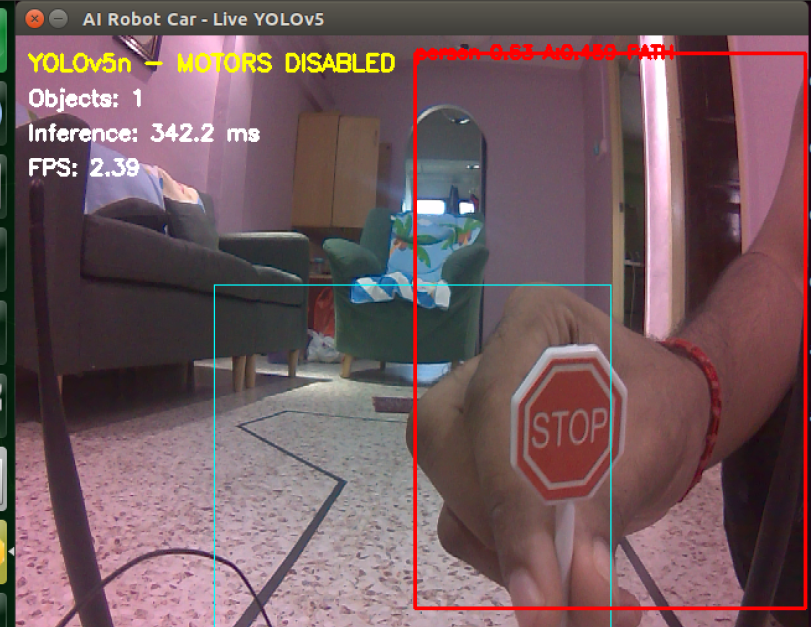

# Perception capability and evidence map

This page separates implemented behaviour from measured evidence. It is the
recommended reference when describing the project in a viva or report.

## Capability boundary

| Capability | Implemented behaviour | Strongest retained evidence | Current claim |
|---|---|---|---|
| Single black-line perception | Selects one plausible black component, fits its path, and reports offset, heading, curvature and confidence | Synthetic regression plus a stationary real-CSI diagnostic at `FULL`, confidence `0.955` | Detector implemented; continuous physical line-following run remains unverified |
| Dual-rail IPM perception | Warps the calibrated ground plane and estimates lane centre from two rails | 30 s physical-CSI run: 343 frames, 11.803985748417533 FPS, 99.12536443148689% full-lane rate | Software verified on physical CSI; motors disabled |
| Object-triggered emergency stop | Maps configured COCO objects to STOP | 60 s integrated physical-CSI dry run: 45 person-stop frames | Verified in a motor-disabled integrated run |
| Stop-sign recognition policy | Maps a fresh COCO `stop sign` result to `STOP_SIGN_DETECTED` | Exploratory dry-run CSV frames 70 to 72 reported `stop sign` at confidence `0.53` | Exploratory only; not an accuracy study and not a current motion gate |
| Obstacle avoidance | Steering around an object or route replanning | None | Not implemented and not claimed |

## Real single-line diagnostic

The saved diagnostic shows one physical black tape line selected as `FULL`,
with confidence `0.955`, steering signal `+0.030`, support `85`, and a single
candidate. The motor battery was disconnected. This is evidence of live
single-line perception, not evidence of a completed moving lap.

## Stop-sign evidence interpretation

This image demonstrates the VNC interface and bounding-box pipeline. The visible
label is `person 0.63`, so the image is not used as stop-sign classification
evidence. A new image becomes admissible only when the saved JSON sidecar reports
`STOP_SIGN_DETECTED` for the same frame.

The exploratory motor-disabled file
`combined_perception_20260720_204831.csv` retained three consecutive rows with
the following relevant fields:

| Frame | Lane state | Decision | Detection |
|---:|---|---|---|
| 70 | `FULL LANE` | `STOP - STOP SIGN` | `stop sign:0.53:0.056:path` and `person:0.75:0.643:path` |
| 71 | `FULL LANE` | `STOP - STOP SIGN` | Same detector result, age 1 frame |
| 72 | `FULL LANE` | `STOP - STOP SIGN` | Same detector result, age 2 frames |

The raw CSV is intentionally not published because it contains local paths and
machine metadata. Its SHA-256 is
`84a4eb50631be0a5a60a38add6cdb7d368547b5116f83eb354833e99fbe4f874`.
No matching hash-bound summary JSON or annotated recognition image was
retained, so this remains `EXPLORATORY` evidence.

## Engineering interpretation

- The pretrained model supplies generic COCO classes. It is not a custom
  traffic-sign model.
- A bounding-box area is an image-space feature, not a calibrated distance in
  metres.
- The safety response is STOP. The project does not claim object-avoidance
  path planning.
- Stale, missing, ambiguous or failed perception removes motion authority.
- A physical motion claim requires matching source/configuration hashes and a
  retained result from the exact deployed build.
