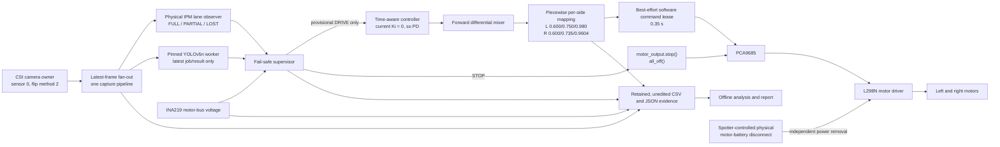
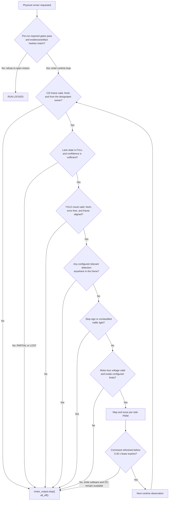

# Sentinel Drive system architecture

## Runtime data and command flow

The CSI/Argus camera has one process owner at a time. During autonomy that
owner publishes the latest frame internally to both IPM and YOLO. The
dashboard must consume a published/derived stream or be run only after the
autonomy camera owner stops; it must not open a competing CSI pipeline.

The dashboard is monitoring-only. It has no drive, motor, or enable-motion
endpoint.

## Motion-authorization decision

`PARTIAL` lane observations are retained for diagnosis only.
`allow_partial_lane_motion` is false and `partial_lane_speed_scale` is 0.0, so
PARTIAL never authorizes motion. Corridor overlap, relative bounding-box area,
and similar YOLO values may be logged, but no calibrated metric object range
exists. The current conservative policy therefore stops for every configured
relevant detection anywhere in the frame; it does not claim that a drawn
corridor proves a clear path.

## Motor mapping

The mapper preserves a zero-command region below `STOP_EPSILON = 0.02`, then
uses two linear segments per side. The logical cruise transition is

`(0.750 - 0.600) / (0.980 - 0.600) = 0.3947368421`.

| Side | Physical floor | Calibrated cruise | Configured maximum |
|---|---:|---:|---:|
| Left | 0.600 | 0.750 | 0.980 |
| Right | 0.600 | 0.735 | 0.9604 |

This is intentionally not a blanket `right_trim` multiplication. Applying
0.98 to the right floor would produce 0.588, below its measured 0.600 physical
breakpoint. The piecewise map keeps both floors at 0.600 while introducing the
right-side correction at cruise and maximum.

## Software lease boundary and physical protection

The 0.35 s command lease is a best-effort software defense. If the control loop
stops refreshing commands while the Python process and watchdog thread remain
schedulable and the shared I2C lock/bus are available, the watchdog requests
`all_off()`.

It cannot guarantee PWM shutdown after SIGKILL, an OS/kernel crash,
process-wide deadlock, a blocked I2C transaction/lock, loss of scheduler
service, or a controller/hardware failure. In particular, software cannot
de-assert PWM while its I2C OFF write cannot execute. Therefore the independent
spotter-controlled motor-battery disconnect is part of the physical safety
architecture, not an optional procedural extra. A future hardware OE/watchdog
path would improve this boundary.

## Evidence and gate promotion

```mermaid
flowchart LR
    SIM["SIMULATED<br/>SITL IPM seed"] --> CAMERA["PHYSICALLY VERIFIED<br/>upright CSI orientation"]
    CAMERA --> YOLOE["SOFTWARE VERIFIED ON PHYSICAL CSI<br/>YOLO benchmark"]
    YOLOE --> CAL["PHYSICALLY VERIFIED<br/>IPM calibration"]
    CAL --> DRY["MOTOR-DISCONNECTED<br/>IPM and integrated dry runs"]
    DRY --> RAISED["PHYSICALLY VERIFIED<br/>raised motor adapter and lease"]
    RAISED --> STEER["PHYSICALLY VERIFIED<br/>short floor steering"]
    STEER --> TRACK["PHYSICALLY MEASURED<br/>guarded track trials"]
    TRACK --> REPORT["Results and defence evidence"]
```

Camera orientation, YOLO regression, IPM calibration/live run, integrated dry
run, raised motor adapter, and `short_floor_steering` are explicit gates.
Steps through the integrated dry run are performed with the motor battery
physically disconnected. Motor power is first connected for the raised test.

For most gates, `validation_manager.py` validates the evidence type and
`passed=true`; the physical IPM gate instead checks the physically calibrated
state in `ipm_config.json`. It records the evidence-file SHA256 and binds the
gate to relevant artifact hashes. A missing, changed, or mismatched file
invalidates authorization. Evidence from a different hash set remains PRIOR
TEST EVIDENCE; it is not a CURRENT pass for the final build. Gate/hash
verification occurs before the physical runner opens the motor interface, not
as a repeated per-frame hash operation. Physical motion still requires the
guarded site, a spotter at the disconnect, voltage checks, and explicit runtime
confirmation even after every software gate passes.
